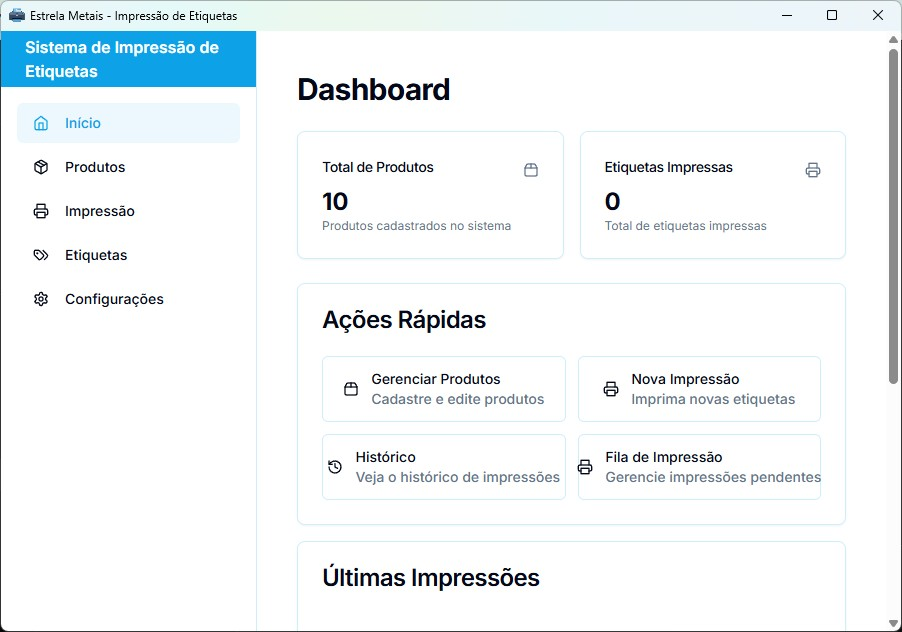
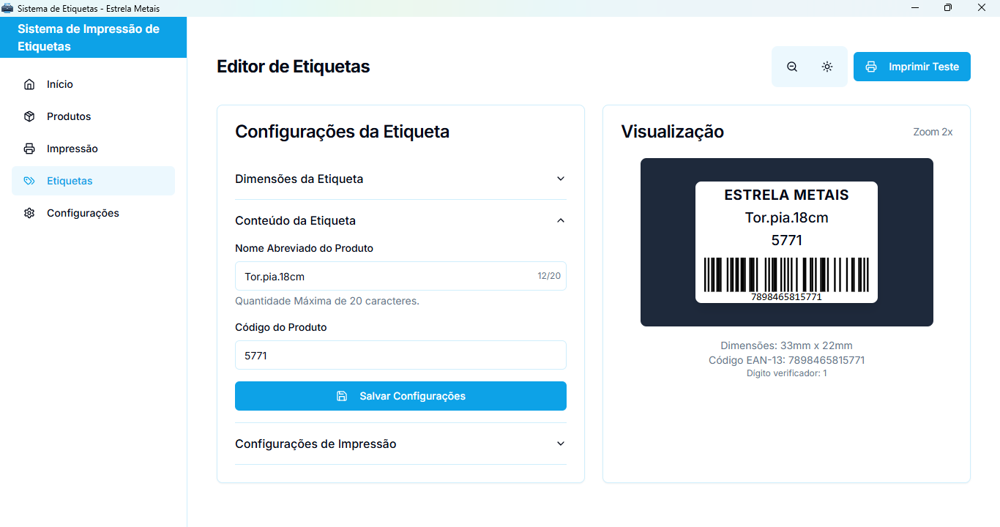
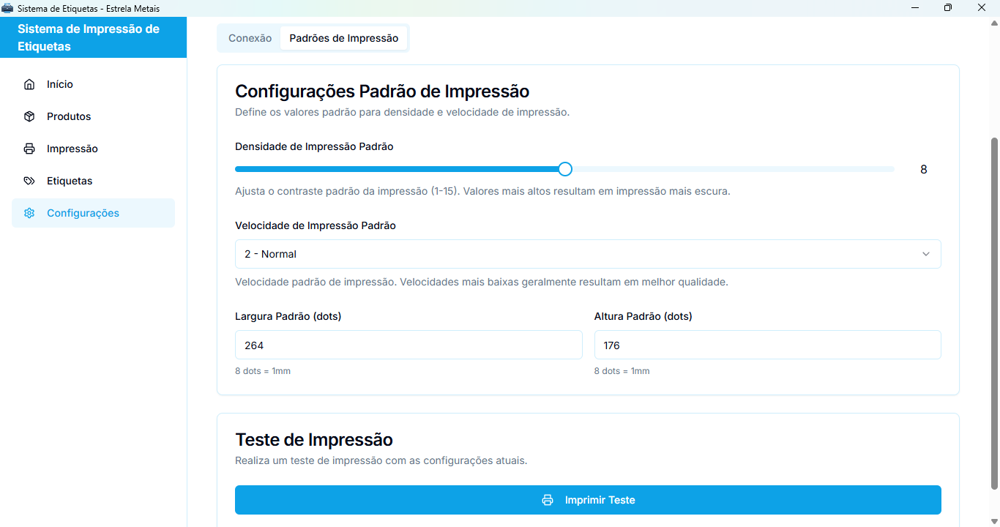

# Sistema de Etiquetas - Estrela Metais

Sistema desktop desenvolvido para a Estrela Metais para impressão de etiquetas térmicas, com suporte ao protocolo PPLA, desenvolvido com Tauri, Next.js e Rust.









## 💡 Funcionalidades

- 📦 **Gerenciamento de Produtos**
  - Cadastro completo de produtos
  - Código de produto personalizado
  - Nome abreviado para etiquetas
  - Busca rápida por código ou nome

- 🏷️ **Impressão de Etiquetas**
  - Suporte a impressoras PPLA
  - Código de barras EAN-13
  - Impressão em lote
  - Preview em tempo real
  - Configuração de densidade e velocidade

- ⚙️ **Configurações Avançadas**
  - Detecção automática de portas
  - Configuração de velocidade e densidade
  - Teste de conexão
  - Monitoramento do status da impressora

- 📊 **Dashboard e Relatórios**
  - Visão geral de produtos
  - Histórico de impressões
  - Estatísticas de uso
  - Status da impressora em tempo real

### Requisitos

- Windows 10 ou superior
- 4GB RAM (mínimo)
- 100MB de espaço em disco
- Impressora térmica compatível com PPLA

### Passos para Instalação

1. Baixe o instalador mais recente da [página de releases](https://github.com/seu-usuario/sistema-etiquetas/releases)
2. Execute o instalador e siga as instruções
3. Conecte a impressora antes de iniciar o sistema
4. Configure a porta e velocidade da impressora nas configurações

## Guia Rápido

1. **Primeiro Uso**
   - Instale o sistema usando um dos instaladores
   - Inicie o sistema através do atalho criado
   - Configure a impressora em "Configurações"

2. **Cadastro de Produtos**
   - Acesse "Produtos"
   - Clique em "Novo Produto"
   - Preencha os dados (nome, nome abreviado, código)
   - Clique em "Salvar"

3. **Impressão de Etiquetas**
   - Acesse "Impressão"
   - Selecione o produto
   - Defina a quantidade
   - Clique em "Imprimir"

4. **Gerenciamento**
   - Acompanhe impressões em andamento em "Fila"
   - Visualize impressões realizadas em "Histórico"
   - Ajuste configurações em "Configurações"


## Tecnologias Utilizadas

- [Tauri](https://tauri.app/)
- [Next.js](https://nextjs.org/)
- [Rust](https://www.rust-lang.org/)
- [SQLite](https://www.sqlite.org/)
- [shadcn/ui](https://ui.shadcn.com/)

## 👩‍💻 Desenvolvimento

Para desenvolver o sistema, você precisará:

```bash
# Instalar dependências
npm install

# Iniciar em modo desenvolvimento
npm run tauri dev

# Gerar instalador
npm run tauri build

## Licença

Todos os direitos reservados 