# Sistema de Impresão de Etiquetas
Sistema desktop desenvolvido para a Estrela Metais para impressão de etiquetas térmicas, com suporte ao protocolo PPLA, desenvolvido com Tauri, Next.js e Rust.

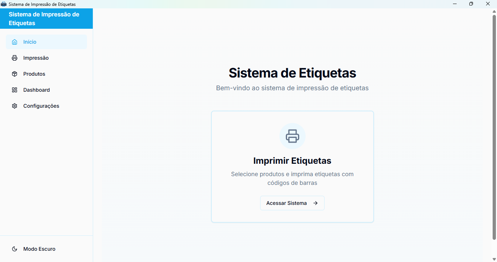

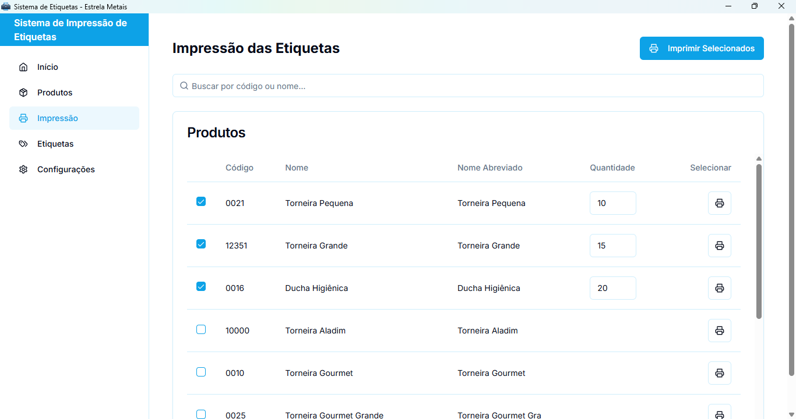

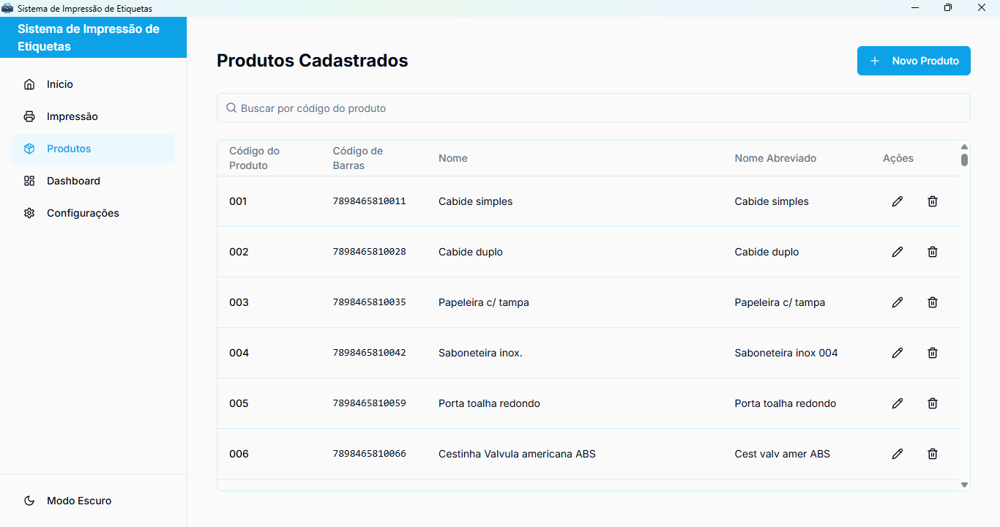

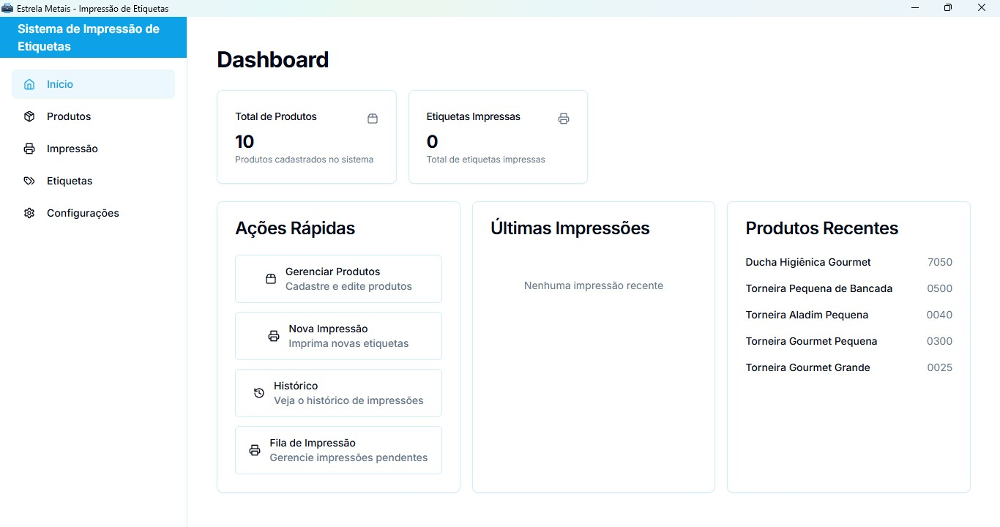

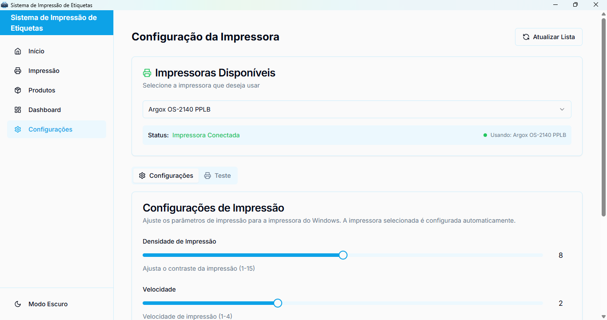

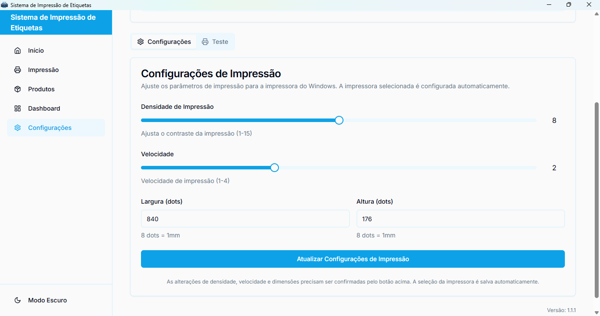

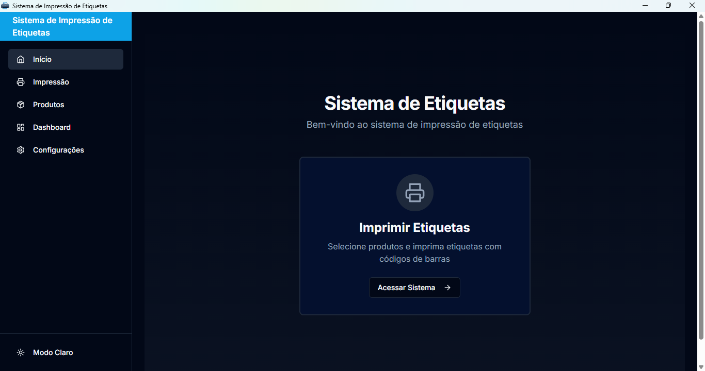


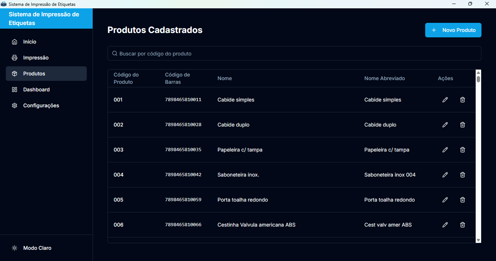

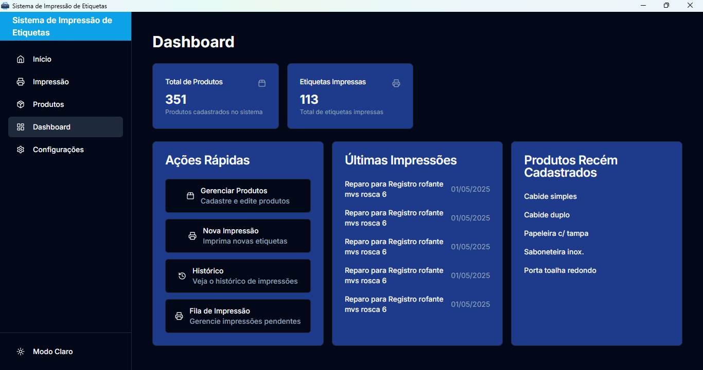

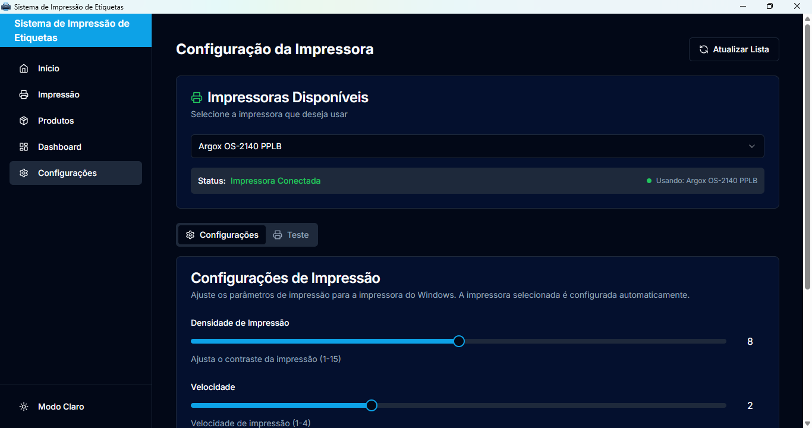

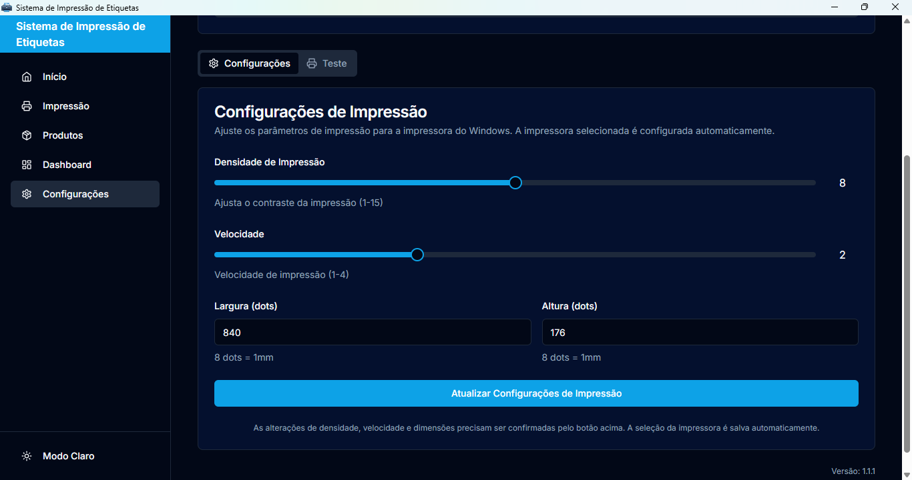


## 💡 Funcionalidades

- 📦 **Gerenciamento de Produtos**
  - Cadastro completo de produtos
  - Código de produto personalizado
  - Nome abreviado para etiquetas
  - Busca rápida por código
  - Geração automática de código de barras do tipo EAN-13

- 🏷️ **Impressão de Etiquetas**
  - Suporte a impressoras PPLA
  - Impressão em lote
  - Preview em tempo real

- ⚙️ **Configurações Avançadas**
  - Modo Claro e Modo Escuro Disponivel
  - Configuração de velocidade e densidade
  - Monitoramento do status da impressora

- 📊 **Dashboard e Relatórios**
  - Visão geral de produtos
  - Histórico de impressões
  - Estatísticas de uso

### Requisitos

- Windows 10 ou superior
- 4GB RAM (mínimo)
- 100MB de espaço em disco
- Impressora térmica Argox SO-2140 ou outra impressora compatível com PPLA

### Passos para Instalação

1. Baixe o instalador mais recente da [página de releases](https://github.com/celsojuniorladislau/SistemaDeImpressaoDeEtiquetas/releases)
2. Execute o instalador e siga as instruções
3. Conecte a impressora antes de iniciar o sistema
4. Instale os drivers da impressora a partir do site da fabricante da impressora, ou verifique se os mesmos estão atualizados

## Guia Rápido

1. **Primeiro Uso**
   - Instale o sistema usando um dos instaladores
   - Inicie o sistema através do atalho criado
   - Configure a impressora em "Configurações": Escolha a Argox SO-2140 ou outra com suporte a PPLA na lista de impressoras disponiveis

2. **Cadastro de Produtos**
   - Acesse a aba "Produtos"
   - Clique em "Novo Produto"
   - Preencha os dados (nome, nome abreviado, código do produto e descrição opcional do produto)
   - Clique em "Criar Produto"

3. **Impressão de Etiquetas**
   - Na Aba "Inicio" clique no botão "Imprimir Etiquetas" ou vá para a aba "Impressão"
   - Digite o Código do produto e aperte ENTRE para proseguir
   - Defina a quantidade e aperte ENTRE para proseguir
   - Clique em "Imprimir Selecionados" ou clique em "Visualizar Etiquetas" e depois clique em "Imprimir Etiquetas"

4. **Gerenciamento**
   - Na aba Dashboard:
      * Visualize impressões realizadas em "Histórico"
      * Acompanhe impressões em andamento em "Fila de Impressão"

   - Na aba Configuração:
      * Ajuste configurações da impressora: Densidade de Impressão, Velocidade, Largura e Altura da etiqueta (em Dots)

   - Na aba Produtos: 
      * Faça edição das informações dos produtos ou exclua-os


## Tecnologias Utilizadas

- [Tauri](https://tauri.app/)
- [Next.js](https://nextjs.org/)
- [Rust](https://www.rust-lang.org/)
- [SQLite](https://www.sqlite.org/)
- [shadcn/ui](https://ui.shadcn.com/)

## 👩‍💻 Desenvolvimento

Para desenvolver o sistema, você precisará:

```bash
# Fazer o Clone do repósitório em sua máquina com git
https://github.com/celsojuniorladislau/SistemaDeImpressaoDeEtiquetas.git

# Instalar dependências
npm install

# Iniciar em modo desenvolvimento
npm run tauri dev

# Gerar instalador
npm run tauri build

## Licença

Todos os direitos reservados 